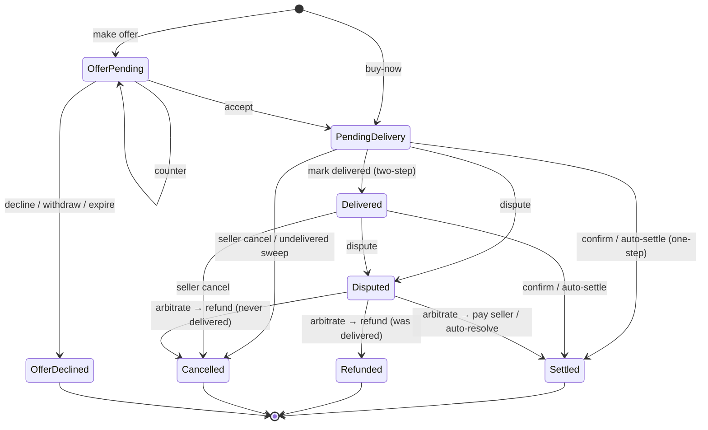

# Muster Shop

The **player marketplace** — members open stores, list items for in-app currency, and trade through an
escrow/authorization flow (the inverse of a quest bounty: a bounty holds the *poster's* funds and pays the
*worker*; a shop order holds the *buyer's* funds and pays the *seller*). Delivery happens out-of-band (in the real
game), so the system can't verify the hand-off — instead funds are **held in escrow at purchase, frozen until the
buyer confirms receipt, then settled to the seller** (less a burned commission). Disputes are arbitrated by a shop
manager.

## Capabilities

- **Stores** — multiple named storefronts per seller; slug-unique per guild; banner/logo/accent, store type, open/closed.
- **Listings** — name, description (Discord markdown), image (+ thumbnail), category, tags, price, currency, stock.
- **Buy-now escrow** — hold buyer funds → confirm → payout to seller, **commission burned** (removed from supply).
- **Offers / counteroffers** — binding holds: a buyer offer escrows immediately; seller can accept/counter/decline; capped per buyer; expire on a sweep.
- **Two-step delivery** (optional) — seller marks *delivered* before the buyer-confirm clock starts; buyer can only confirm once delivered.
- **Disputes + arbitration** — either party disputes (with evidence); a shop manager pays the seller or refunds the buyer; auto-resolves on timeout favouring the non-disputing party.
- **Ratings** — blind-mutual 1–5★ on settled orders; revealed when both rate or the window closes; managers can hide abusive ones.
- **Featured listings** — paid feature slots (flat fee, burned); capped per store; newest-featured surfaced first.
- **Multi-currency** — any spendable currency, optionally restricted to an allow-list; price floor/ceiling.
- **Surfaces** — Web (Blazor), Discord bot (grouped `/shop` commands + interactive cards + DM push), REST API (`read:shop` / `write:shop`). All share the command funnel + authorizer + feature gate.
- **Automated sweeps** — auto-settle, auto-cancel-undelivered, auto-resolve-disputes, offer-expiry, rating-reveal, featured-expiry, listing-expiry.
- **Full auditing** — every order action (command + system sweep) recorded under the `Shop` audit category.
- **Feature gating** — the whole feature can be enabled/disabled per guild + platform-wide. See [feature-gating.md](feature-gating.md).

## Order workflow

### States

| State | Meaning | Terminal |
|-------|---------|----------|
| **OfferPending** | A price offer in negotiation; buyer's funds held when the buyer proposed the current price. | |
| **PendingDelivery** | Paid into escrow, awaiting buyer confirmation (and seller delivery under two-step). | |
| **Delivered** | Seller marked the item handed over (two-step); buyer-confirm clock running. | |
| **Disputed** | Either party raised a dispute; awaiting a manager. | |
| **Settled** | Buyer confirmed (or auto-settled): paid to seller, commission burned. Ratings open. | ✓ |
| **Refunded** | Dispute resolved buyer-favourably on a *delivered* order — escrow returned, no fee. | ✓ |
| **Cancelled** | Seller cancelled, undelivered sweep, or a dispute on a *never-delivered* order — escrow returned, no fee, stock released. | ✓ |
| **OfferDeclined** | Offer declined / withdrawn / expired — held funds returned. | ✓ |

### Actions by state

| State | Action | Who | → |
|-------|--------|-----|---|
| **Offer pending** | Accept | the side not holding the turn (seller/manager on a buyer offer; buyer on a counter) | Pending delivery |
| | Counter | the side whose turn it is | Offer pending (re-holds/releases escrow) |
| | Decline / End / Withdraw | buyer, seller, or manager | Offer declined |
| | *Auto-expire* (`OfferExpiryHours`) | sweep | Offer declined |
| **Pending delivery** | Confirm receipt | buyer *(blocked under two-step until Delivered)* | Settled |
| | Mark delivered | seller / manager *(two-step)* | Delivered |
| | Cancel & refund | seller / manager | Cancelled |
| | Dispute | buyer or seller | Disputed |
| | *Auto-settle* (`DeliveryConfirmTimeoutHours`, one-step only) | sweep | Settled |
| | *Auto-cancel* (`UndeliveredTimeoutHours`, two-step undelivered) | sweep | Cancelled |
| **Delivered** | Confirm / Cancel / Dispute | as above | Settled / Cancelled / Disputed |
| | *Auto-settle* | sweep | Settled |
| **Disputed** | Arbitrate → pay seller | **manager** | Settled |
| | Arbitrate → refund buyer | **manager** | Refunded *(or Cancelled if never delivered)* |
| | *Auto-resolve* (`DisputeTimeoutHours`) | sweep — favours the **non-disputing** party | Settled / Refunded / Cancelled |
| **Settled** | Rate (blind-mutual) | buyer ↔ seller, within the rating window | — |

### Money & timing rules

- **Escrow is held from purchase until confirmation** (settle), *not* released at delivery — so seller-cancel is safe any time before the buyer confirms.
- **Confirm gating**: under two-step delivery the buyer can only confirm once the seller marks delivered; auto-settle likewise waits for `Delivered`.
- **Undelivered protection**: a two-step order the seller never delivers is auto-cancelled + refunded after `UndeliveredTimeoutHours` (0 = off).
- **Dispute resolution** chooses the terminal state by delivery: never-delivered (two-step) refund → **Cancelled**; delivered/one-step refund → **Refunded**; pay-seller → **Settled**. Auto-resolve favours the party that *didn't* raise the dispute.
- **Commission** is burned on settlement: `fee = round(amount × bps / 10000)` (category override else guild `CommissionBps`); waived on any refund/cancel.
- **No buyer-initiated cancel** — a buyer's pre-settle exits are confirm or dispute.

## Roles

`ShopCreator` (open stores, list/sell) and `ShopManager` (moderate, arbitrate, manage categories/types; implies creator). Buying needs only participant. Enforced by `IShopAuthorizer`; the same authorizer is the server-side feature-gate chokepoint.

## Surfaces

All three surfaces dispatch the **same CQRS commands** through the **same `IShopAuthorizer`**, so authorization, the
commission burn, and **feature gating** behave identically. See [feature-gating.md](feature-gating.md) for the
per-surface gating policy.

### Web (`Components/Pages/Shop/`)

Hub (browse listings + shops), storefront, store management, listing create/edit, orders (Purchases / Sales / Offers /
Disputes tabs), order receipt. Item detail is modal-only; `/shop/listing/{id}` is the id-stable permalink that
redirects into the storefront modal. Pages full-gate when the shop is off; the orders/receipt wind-down surfaces stay
reachable while merely guild-disabled. Admin config + categories + store types + images are web-only.

### Bot (`Bot/Shop/`)

Root `/shop`, grouped:

| Group | Subcommands |
|-------|-------------|
| *(discovery)* | `browse [store]`, `stores [mine]`, `search <term>`, `resync` |
| `/shop store` | `create`, `edit`, `open`, `close`, `delete`, `resync` |
| `/shop listing` | `add`, `edit`, `cancel`, `feature`, `unfeature` |
| `/shop orders` | `list`, `disputes` (manager) · direct: `confirm`, `deliver`, `cancel`, `dispute <reason>`, `resolve <pay\|refund>` (manager) |

Order params use autocomplete (your orders / open disputes); listing/store/category/type params autocomplete too.
Both flows exist for orders: the `list` / `disputes` pickers (point-and-click buttons) **and** the direct slash
commands above. **Feature-gated** in `MusterModuleBase`: discovery + management require the shop **Enabled**; order
commands use the **wind-down** gate (`CanEnable`). A gated command replies "🔒 This feature isn't enabled on this
server." (commands can't be hidden per-guild — Discord registers them globally). Category/store-type vocab, settings,
and images are **not** on the bot (web-only).

**Cards** (embeds + components): browse hub (filters, nav, Buy/Offer/Featured, My-orders, store directory), item
detail, store directory, order picker, order receipt (viewer-appropriate buttons incl. arbitrate), public **featured
cards** in the shop channel, dispute alerts in the mod channel. **Modals:** offer amount, dispute reason, counter
price, rating comment.

**DMs** (`ShopDmPushHandler`, to the party an event is about): *action cards* with the recipient's buttons —
Purchased→seller, Delivered→buyer, OfferMade→seller, OfferCountered→other party, OfferAccepted→proposer; *outcome
notices* (button-less) — Settled, Cancelled, Refunded, OfferRejected, Arbitrated, Rated, + listing-takedown. Disputes
have no DM (they route to the mod channel).

### API (`/api/v1/guilds/{guildId}/shop`)

REST under Wolverine.HTTP, scoped `read:shop` / `write:shop`; writes require a bound actor and **run as the key's
`ApiClient.ActsAsUserId`** (no actor id in request bodies). Guild + IDs are required in the path. Feature gating is
enforced automatically because writes hit `IShopAuthorizer` (blocks on a platform/plan block; guild-off still returns
the service's `NotActive`).

| Method · path | Scope |
|---|---|
| `GET /shop`, `/shop/stores/{slug}`, `/shop/listings/{id}`, `/shop/categories`, `/shop/store-types` | `read:shop` |
| `GET /shop/settings`, `/shop/orders`, `/shop/orders/{id}`, `/shop/orders/{id}/ratings`, `/shop/disputes` | `read:shop` + actor |
| `POST /shop/stores`, `.../{id}/edit`, `DELETE .../{id}`, `.../{id}/resync` | `write:shop` + actor |
| `POST /shop/categories`/`store-types` (+ `/{id}/edit`, `DELETE`) | `write:shop` + actor |
| `POST /shop/listings`, `.../{id}/edit`\|`cancel`\|`feature`\|`unfeature`\|`buy`\|`offer` | `write:shop` + actor |
| `POST /shop/orders/{id}/delivered`\|`confirm`\|`cancel`\|`dispute`\|`arbitrate`\|`accept-offer`\|`counter-offer`\|`decline-offer`\|`withdraw-offer`\|`rate` | `write:shop` + actor |
| `POST /shop/ratings/moderate`, `/shop/resync` | `write:shop` + actor |

> Storefront reads are by **slug** today; everything else is by id. A future admin/guild **system token** (operate as
> the system, unbound to a user) is an auth-layer change only — the endpoint layout + command funnel stay identical.

## Configuration

Per-guild `GuildShopSettings` (table-per-feature) — toggles (market enabled, offers, two-step, ratings, tags, require-category), caps, economy (commission, floor/ceiling, allowed currencies, featured fee), timers (`DeliveryConfirmTimeoutHours`, `UndeliveredTimeoutHours`, `DisputeTimeoutHours`, `OfferExpiryHours`, listing expiry/cooldown, `RatingWindowHours`, `FeaturedDurationHours`), channels. Edited at `/guilds/{id}/management/shop`. App-level caps/limits live in appsettings.

## Related docs

- [feature-gating.md](feature-gating.md) — how the shop is enabled/disabled per surface.
- [data-model.md](data-model.md) · [api.md](api.md) · [discord-integration.md](discord-integration.md)
