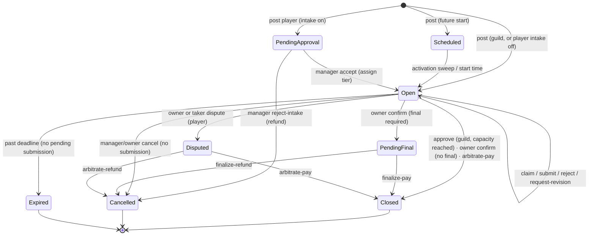
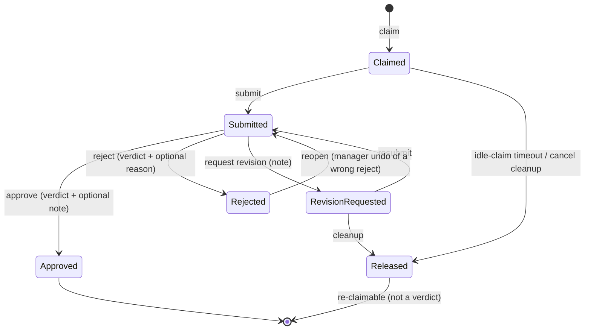

# Guild Quests — engine reference

The quest board is an anime-style **GuildMaster** quest system. A GuildMaster (quest manager / admin) posts
guild quests, sets difficulty tiers, approves submissions, and arbitrates disputes; members claim quests, submit
work, and get rewarded. This document is the complete reference for the engine: data model, state machine,
funding models, the CQRS command surface, authorization, auto-resolve, notifications, and guardrails.

> Replaces the former `docs/quest-state-machine.md` (removed).

---

## 1. Concept & funding models

One board, one aggregate (`GuildQuest` + `QuestParticipant`), split by **origin**:

| Origin | Funding | Reward flows | Posted by | Tiered |
|--------|---------|--------------|-----------|--------|
| **Guild** (`QuestOrigin.Guild`) | Guild **mints** the reward on approval (nothing held) | minted → completer | a Quest Manager | at **post** time |
| **Player** (`QuestOrigin.Player`) | Poster's own currency is **escrowed** at post time | escrow → completer on settle, or refunded | any member | at **intake** by a manager |

Shared by both: `QuestStatus`, `QuestParticipant`, the escrow ledger legs, and the difficulty-tier → bonus-POINTS
config map. **One completion per member** (a member can't double-dip). A guild quest may be completed by up to
`Capacity` *distinct* members; player quests are single-taker.

Money is never free-form: a manager sets a **tier** (E–S) and the bonus POINTS come from
`GuildSettings.Quests.PointsForTier(tier)`. The currency reward amount is set on the quest; bonus POINTS are
separate and minted on settlement.

---

## 2. Data model

`GuildQuest` (`src/Muster.Domain/Entities/Quests.cs`):
- `Origin`, `Status`, `StatusChangedAt` (drives anti-staleness timeouts), `RowVersion` (optimistic concurrency).
- `CreatedBy` / `OwnerId` (owner = creator for guild; poster for player — the escrow source/refundee).
- `RewardCurrencyId` / `RewardAmount`; `Tier` / `BonusPoints`; `Capacity`; `EscrowAmount` (player only).
- `Deadline`, `ScheduledStart`, `RequiresFinalApproval`, `DisputedBy` (who raised the active dispute).
- `Participants` — the claim/submit/verdict rows.

`QuestParticipant`:
- `Status` (`QuestParticipantStatus`), `ClaimedAt` / `SubmittedAt` / `ReviewedAt`.
- `Note` — the worker's submission note. `ReviewNote` — the reviewer's note on **approve / revise / reject**.
- `ReviewedBy` — the manager who issued the verdict (also the arbiter on a paid dispute). `RevisionCount`.

Factory `GuildQuest.Create(QuestDraft)` derives the starting status and escrow; `TransitionTo(next)` is the single
guarded status mutation (idempotent; throws out of a terminal state).

---

## 3. Quest states (`QuestStatus`)

| State | Meaning | Applies to |
|-------|---------|-----------|
| `Scheduled` | Future start; not claimable until activated | both |
| `PendingApproval` | Player quest awaiting a manager's intake accept + tiering | player |
| `Open` | Claimable / in progress | both |
| `PendingFinal` | Owner accepted; awaiting a manager's final sign-off before payout | player |
| `Disputed` | Owner or taker raised a dispute; awaiting manager arbitration | player |
| `Closed` | Settled (completer paid / minted) | both |
| `Cancelled` | Refunded (intake-reject / cancel / refund-arbitration / final-refund) | both |
| `Expired` | Past deadline before completion (refunded if escrowed) | both |

Terminal = `Closed` / `Cancelled` / `Expired` (`TransitionTo` throws if you try to leave one).

### State flow

> Note: a guild quest with `Capacity > 1` stays `Open` after an approval until `Approved` count reaches `Capacity`.

---

## 4. Participant lifecycle (`QuestParticipantStatus`)

- **Approve / Reject are final per member** — re-claiming is barred (`ClaimAsync` → `AlreadyParticipated`).
  `RevisionRequested` is the sanctioned retry; `Reopen` is the misclick undo (Rejected → Submitted).
- **`Released`** (idle-claim timeout or cancel cleanup) is *not* a verdict, so the member may re-claim later.
- Every verdict records `ReviewedBy` + (optionally) `ReviewNote`. `RevisionCount` increments on each send-back;
  `GuildSettings.Quests.MaxRevisions` caps the round-trips (`0` = unlimited).

---

## 5. Funding-model walkthroughs

**Guild quest:** `post (manager, tier) → Open` → member `claim` → `submit` → manager `approve` ⇒ **mint** reward
+ tier POINTS to the member; quest `Closed` when `Approved` reaches `Capacity`. Manager may `reject` (stays Open
for others), `request-revision` (member resubmits), or `cancel` before work starts. Reward/tier/slots are editable
only while no one is working on it.

**Player bounty:** `post (escrow held)` → `PendingApproval` (intake on) or `Open` (intake off). Manager `accept`
assigns the tier and opens it (or `reject-intake` → refund). Member `claim` → `submit`. Owner `confirm`:
pays the completer from escrow (`Closed`), or → `PendingFinal` if final sign-off is required. Owner or taker may
`dispute` → `Disputed` → manager `arbitrate(pay|refund)`. Owner may `cancel` (refund) before a submission. Money
moves and the status change commit in one transaction.

`AllowSelfParticipation` (guild setting, default off) lets a poster take & complete their own player quest — the
escrow round-trips to them (handy for solo/small guilds and testing).

---

## 6. CQRS command surface

Every surface (Discord bot, Web, future API) invokes the **same 15 commands** via `IMessageBus` — never the
service directly. The thin static handlers in `src/Muster.Infrastructure/Messaging/QuestCommandHandlers.cs` are the
single funnel: **load → authorize (`IQuestAuthorizer`) → delegate to `IQuestService` → `Result`**. Auditing is a
Wolverine middleware (`AuditMiddleware`) on `IGuildCommand` chains.

| Command | Who | Effect |
|---------|-----|--------|
| `PostQuest` | manager (guild) / member (player) | validates, resolves currency, routes by origin, escrows |
| `ClaimQuest` | eligible member | claim a slot (honours per-user claim cap) |
| `SubmitQuest` | claimer | submit / resubmit work (+ note) |
| `ApproveQuestSubmission` | manager | mint reward (guild) (+ optional praise note) |
| `RejectQuestSubmission` | manager | final reject (+ optional reason); stays open |
| `ReopenQuestRejection` | manager | undo a wrong reject |
| `RequestQuestRevision` | manager (guild) / owner (player) | send back for revision (+ note) |
| `CancelQuest` | manager (guild) / owner (player) | cancel uncompleted (refund if player) |
| `ConfirmQuest` | owner | pay completer (or → final sign-off) |
| `DisputeQuest` | owner or taker | raise a dispute |
| `ArbitrateQuest` | manager (recused if a party) | resolve dispute pay/refund |
| `AcceptQuestIntake` | manager | accept + tier a pending player quest |
| `RejectQuestIntake` | manager | reject at intake (refund) |
| `FinalizeQuest` | manager | final sign-off pay/refund |
| `EditQuest` | manager (guild) / owner (player) | patch fields before anyone works |

Reads go through `IQuestReadService` (DTOs, no bus, no `DbContext` leaks): board page, quest detail (+ participants,
reviewers, dispute), edit view, open-board list. The board is filtered on two axes — **tab** × **scope**:

- **tab**: `active` (non-terminal: not Closed/Cancelled/Expired), `actionneeded` (the manager review queue — guild
  Open+Submitted plus player PendingApproval/PendingFinal/Disputed; **empty for non-managers**), `history` (terminal,
  scoped to quests the viewer owns/participated in for non-managers).
- **scope**: `guild` (system-posted official duties), `player` (any player-posted bounty), `mine` (anything personal
  to **you** — bounties you posted **plus** any quest you claimed/participated in, including guild duties; an
  unclaimed guild duty you merely posted is *not* "mine"), or all.

---

## 7. Authorization

`IQuestAuthorizer` (`QuestAuthorizer.cs`) centralizes every rule, host-agnostic via a `GuildActor(GuildId, UserId)`:
- `Claim`/`Submit`/`View` → any guild participant.
- `Approve`/`Reject`/`Reopen`/`Arbitrate`/`AcceptIntake`/`RejectIntake`/`Finalize` → GuildMaster.
- `Edit`/`Cancel`/`RequestRevision` → manager (guild) or owner (player).
- `Confirm`/`Dispute` → owner/taker (player only).
- **Recusal:** `ArbitrateAsync` rejects an arbiter who is the owner or taker (system arbiter `0` exempt).

The pure `Allows(actor, isManager, origin, ownerId, isTaker, permission)` rule is shared by the handler and the
Web UI for button visibility (no rule duplication). Discord `RequiredRole.QuestManager` remains as defense-in-depth.

---

## 8. Auto-resolve (anti-staleness)

A once-a-minute idempotent sweep (`QuestMaintenanceService` via `QuestSweepScheduler`) drives stuck quests forward
using per-guild timeouts (hours; `0` = disabled). Each fires only when `now - <entered-at> > timeout`:

| Setting | Trigger | Outcome (`*Action`) |
|---------|---------|---------------------|
| `IntakeTimeoutHours` / `Action` | `PendingApproval` since `StatusChangedAt` | `Decline` (refund) · `Accept` (open, no tier) |
| `ClaimTimeoutHours` | `Open` w/ an idle `Claimed` taker since `ClaimedAt` | release taker → `Open` |
| `SubmissionTimeoutHours` / `Action` | `Open` w/ a `Submitted` taker since `SubmittedAt` | `Approve` (settle/mint) · `Reject`/revise · `Dispute` (player → arbitration; guild falls back to revision) |
| `FinalApprovalTimeoutHours` / `Action` | `PendingFinal` since `StatusChangedAt` | `Approve` (pay) · `Refund` |
| `DisputeTimeoutHours` | `Disputed` since `StatusChangedAt` | auto-resolve **favouring the non-disputing party** (the disputant bears the burden) |

`SubmissionTimeoutHours = 0` is an explicit "a human always decides" opt-out: a submitted quest then waits on a
verdict indefinitely and may outlive its deadline (deadline expiry deliberately skips quests with a pending
submission). Auto-resolves reuse the same `QuestService` transitions as the manual path (so the lifecycle event is
published once), and additionally write an audit entry (actor `0` = system).

---

## 9. Notifications

`QuestService` publishes one Wolverine message after each transition commits:
`QuestLifecycleNotified(GuildId, QuestId, QuestName, QuestLifecycleMoment, TargetUserId, Detail)`. `Moment` carries
the targeting intent (`Created`, `PendingApproval`, `Accepted`, `Claimed`, `Submitted`, `RevisionRequested`,
`AwaitingFinalApproval`, `Disputed`, `Settled`, `RejectedAtIntake`, `Refunded`, `Reopened`, `Released`);
`TargetUserId` is who should hear about it (null = managers / board).

There is no `IQuestNotifier` — consumers subscribe to the message. The **Bot host** consumes it
(`QuestBoardNotificationHandler`) to drive a **live channel board**: when `QuestSettings.QuestChannelId` is set, each
quest gets one auto-updating embed card in that channel, edited in place on every transition (the bot's analogue of
the web card; `QuestEmbedRenderer` builds the embed, tier colour echoing the web edge). The link between a quest and
its message is the `PostedMessage` table (`(EntityType, EntityId) → ChannelId, MessageId`), so the handler is
idempotent — it re-reads current state and edits the tracked message, so redelivery / out-of-order events converge.
**Scheduled quests aren't posted until they open** (activation publishes a `Created` moment). **Self-healing:** no
row → create + save the id; a row whose Discord message was deleted → the edit 404s, so it re-posts and saves the
new id. The card shows type, status (emoji cue), reward (coin + tier points), slots, completions, opens/expires
(Discord timestamps), dispute, and a participant roster (`<@id>` + per-row reviewer — embed mentions never ping).

Because a quest can change from **any** host (web, API, bot, the auto-resolve sweep) but only the bot can render to
Discord, `QuestLifecycleNotified` is routed over a **durable Wolverine SQL Server queue** (`quest-board`): every host
publishes to it (transactional outbox), only the bot listens. Unset channel → the board stays pull-only (`/quest list`).

**Mod vs public routing.** A quest's single card lives in the channel its phase belongs to: mod-only states
(`PendingApproval` intake, `Disputed`, `PendingFinal`) post to a private **mod channel** (`QuestModChannelId`,
locked down by the guild's Discord perms) so the public never sees unvetted/admin-only quests; everything else
goes to the public board. Crossing the boundary (e.g. intake accept `PendingApproval→Open`) **moves** the card —
Discord can't relocate a message, so the old one is deleted and a fresh one posted (`PostedMessage` repointed). A
mod-only state with no mod channel set posts **nowhere**. Dispute / final sign-off are *temporary detours* for an
already-public quest, so on resolution the card **returns to the public board**; a quest rejected at intake (never
public — tracked by `PostedMessage.EverPublic`) stays out of public view when it closes.

Set channels from **Admin → Role mapping** (web `<select>`s, channels fetched live from Discord — no table) or
`/quest config channel` / `/quest config modchannel` (native Discord channel pickers). All call
`ConfigCommandService.SetQuestBoardAsync`.

**Cleanup.** A completed card stays live through its terminal state (Closed/Cancelled/Expired) for
`QuestSettings.BoardRetentionHours` (default 48; 0 = remove immediately), then the bot's `QuestBoardCleanupScheduler`
(5-min timer) deletes the Discord message and drops the `PostedMessage` link — best-effort (404 swallowed) and
`ExecuteDelete`-by-id, so it's safe on multiple nodes. The quest + ledger stay in the DB, so the **web keeps full
history**; only the channel card is ephemeral.

---

## 10. Guardrails (`GuildSettings.Quests`)

- `PersonalQuestIntakeApproval` — player quests need manager intake before opening.
- `FinalApprovalMode` — `Off` / `OwnerChoice` / `ApproverChoice` / `Forced` → `RequiresFinalApproval`.
- `AllowSelfParticipation` — let a poster take their own player quest (default off).
- `MaxOpenQuestsPerPoster` / `MaxActiveClaimsPerUser` / `MaxRevisions` — caps (`0` = unlimited).
- Tier→points map (`TierEPoints … TierSPoints`, read via `PointsForTier`).
- `RowVersion` optimistic concurrency stops two actors settling the same quest.

---

## 11. Surfaces

- **Discord** (`QuestModule`) — `/quest` subcommand tree dispatching the CQRS commands; `/quest list` exposes the
  same tab (`Active`/`Action Needed`/`History`) × scope (`All`/`Guild`/`Player`/`Mine`) filters.
- **Web** (`Quests.razor` board, `QuestDetail.razor`, `QuestPost.razor`, `QuestEdit.razor`) — card board with tier
  rank badges + colored edges, two segmented filter groups (Active/Action Needed/History × All/Guild/Player/Mine),
  a detail page with the full participant roster (status rings, reviewer, dispute trail) and inline per-participant
  actions with per-row feedback notes.
- **API** — `/api/v1/guilds/{id}/quests` (`read:quests`/`write:quests`), same commands, same tab/scope filters
  (see [api.md](../api.md)).

## 12. Tests

- **Domain state machine** (`Muster.UnitTests/QuestStateMachineTests.cs`) — `Create`/`TransitionTo` guards +
  every `QuestParticipant` verdict transition (valid moves, idempotency, illegal moves throw, notes).
- **CQRS handler flows** (`Muster.IntegrationTests/Messaging/QuestCommandFlowTests.cs`) — full guild + player
  lifecycles through the handlers (approve/reject/revise/cancel/edit, confirm, intake accept/reject, dispute→
  arbitrate, finalize, zero-reward guard).
- **Handler auth/guards** (`QuestCommandHandlerTests.cs`), **reject/reopen** (`RejectReopenTests.cs`),
  **maintenance sweeps** incl. guild paths (`QuestMaintenanceTests.cs`), **reads** (`QuestReadServiceTests.cs`).
